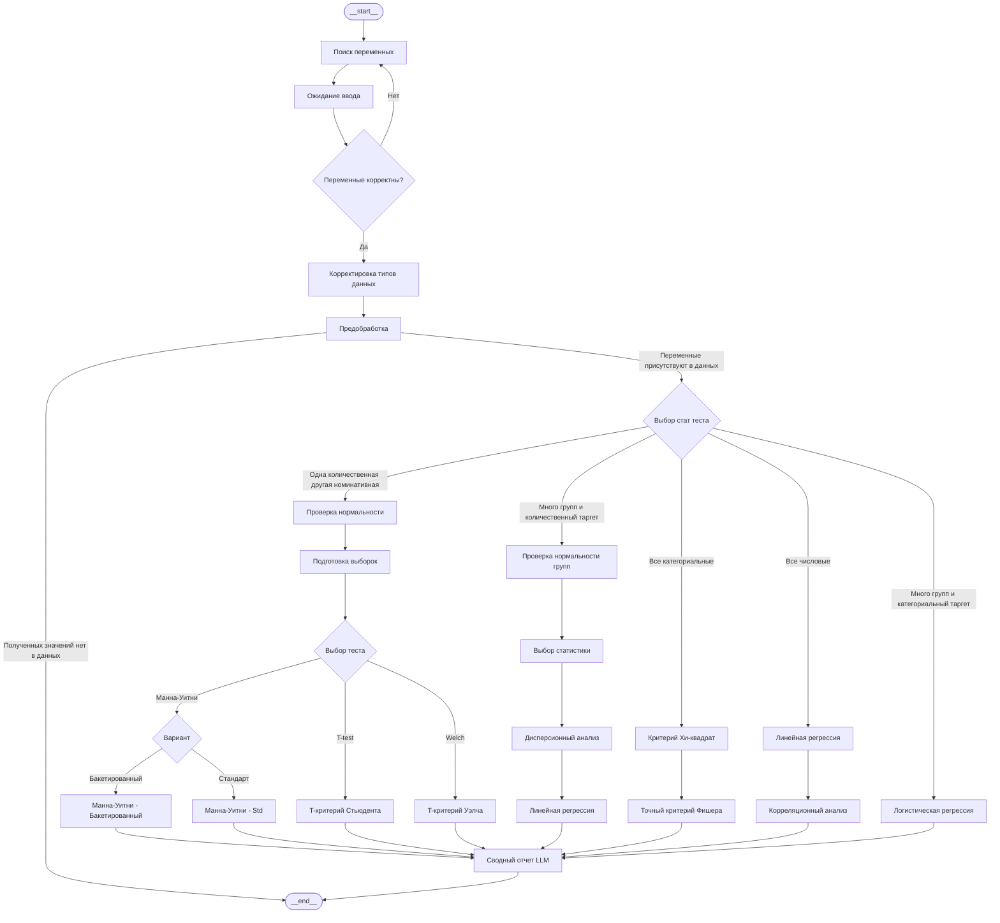
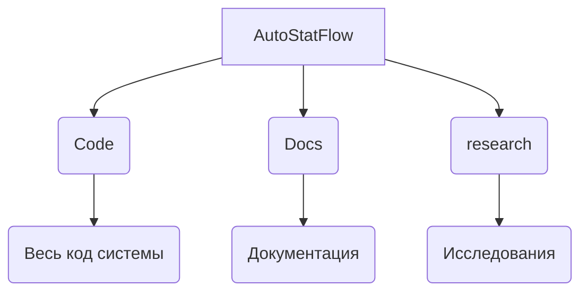

# Система для автоматической проверки статистических гипотез
Этот репозиторий содержит код для системы на [LangGraph](https://www.langchain.com/langgraph), которая способна за **3-4** секунд проверять статистические гипотезы, по табличным данным.\
Используя проверки условий применения стат. методом, система подберет стат. тест, и проверит гипотезу. После, предоставит полноценную сводку исследования.

# Граф работы системы


# Пример работы системы


# Инструкция по установке и запуску

### 1. Клонирование репозитория
Склонируйте проект на локальный компьютер и перейдите в рабочую директорию:
```bash
git clone https://github.com
cd Sirius_BC26
```

### 2. Создание виртуального окружения
Создайте изолированное окружение, чтобы избежать конфликтов библиотек:

**Windows:**
```bash
python -m venv venv
venv\Scripts\activate
```

**MacOS / Linux:**
```bash
python3 -m venv venv
source venv/bin/activate
```

### 3. Установка зависимостей и настройка ядра
Установите необходимые пакеты и зарегистрируйте окружение в Jupyter:
```bash
pip install -r requirements.txt
pip install ipykernel
python -m ipykernel install --user --name=venv --display-name "Python (Sirius_BC26)"
```

### 4. Запуск
1. Откройте ноутбук [CodeOfSystem.ipynb](Code/CodeOfSystem.ipynb) через VS Code или Jupyter Lab.
2. В интерфейсе выбора ядра (обычно в правом верхнем углу) выберите **"Python (Sirius_BC26)"**.
3. Теперь вы можете запускать ячейки кода.


# Структура проекта

## Лицензия
Этот проект распространяется под лицензией MIT.


# English
This repository contains code for a system at [LangGraph](https://www.langchain.com/langgraph), which is capable of testing statistical hypotheses in **3-4** seconds, according to tabular data.\
comply with the conditions for checking the application of stat. method, system select stat. test and tests the hypothesis. After this, an additional full summary of the study.
