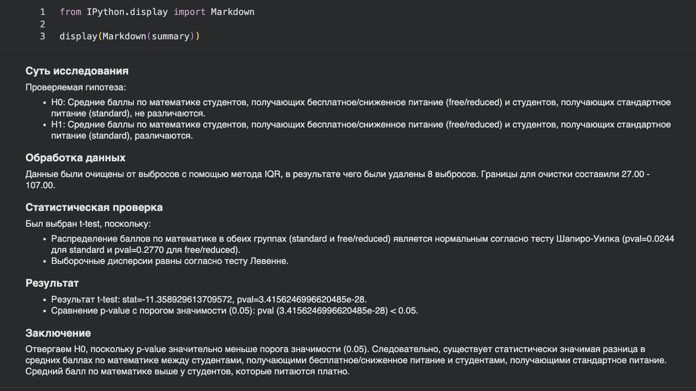
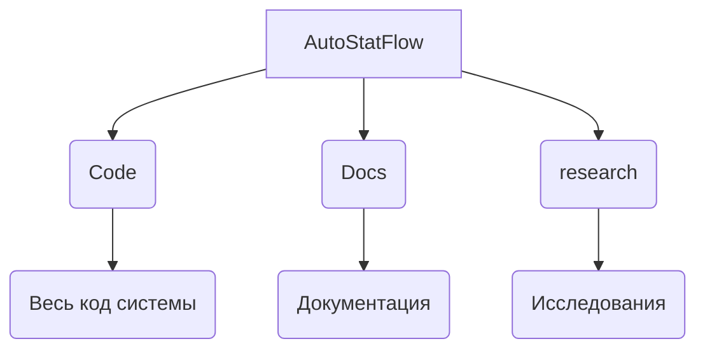

# Система для автоматической проверки статистических гипотез
Этот репозиторий содержит код для системы на [LangGraph](https://www.langchain.com/langgraph), которая способна за **6-10** секунд проверять статистические гипотезы, по табличным данным.\
Используя проверки условий применения, система на базе LLM подберет статистический тест, и проверит гипотезу. После, предоставит полноценную сводку исследования.

# Пример работы системы

# Installation
1. Клонирование репозитория:
   git clone https://github.com/dmibar/Sirius_BC26.git
    cd Sirius_BC26
2. Создание виртуального окружения:\
Windows:
* python -m venv venv
    * venv\Scripts\activate

MacOS/Linux
* python3 -m venv venv
    * source venv/bin/activate

3. Установка зависимостей\
pip install -r requirements.txt\
pip install ipykernel\
python -m ipykernel install --user --name=venv --display-name "Python (Sirius_BC26)"

4. Запуск\
Откройте [code](https://github.com/dmibar/Sirius_BC26/blob/main/Code/CodeOfSystem.ipynb).ipynb через Jupyter (например VS Code)\
В правом верхнем углу (выбор Kernel) выберите созданное окружение: "Python (Sirius_BC26)".

# Структура проекта

## Лицензия
Этот проект распространяется под лицензией MIT.

# English
This repository contains code for a system on [LangGraph](https://www.langchain.com/langgraph), which is capable of testing statistical hypotheses using tabular data in **6-10** seconds.\
Using application condition checks, the LLM-based system will select a statistical test and test the hypothesis. Afterwards, it will provide a full summary of the study.
